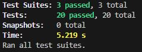
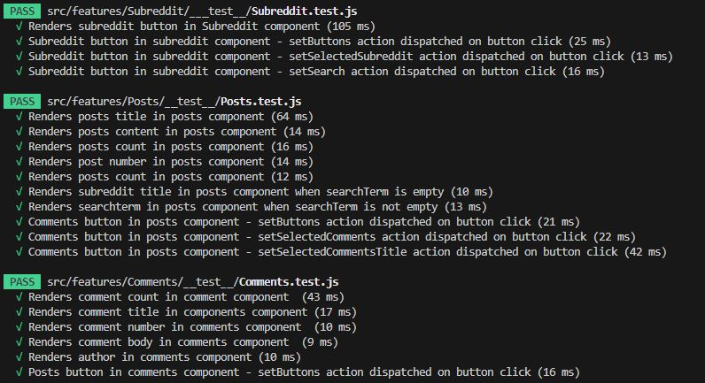

# Richie Reddit App

## Contents
[Website Link](#website-link) 
[Wireframe](#wireframe) 
[Technologies](#technologies) 
[About](#about) 
[Installation](#installation) 
[Current Step](#current-step) 
[Lighthouse Report](#lighthouse-report) 
[Testing](#testing) 
[Test Results](#test-results) 
[Future Additions](#future-additions) 
[Last Push](#last-push) 

## Website Link
https://richie-reddit-app.netlify.app

## Wireframe

## Technologies
1. HTML.
2. CSS.
3. React.
4. Redux.

## About
This project is a simplified version of the Reddit website. 
A list of subreddits is requested from the Reddit API and mapped to buttons on the LHS of main page. When a subreddit button is clicked the relevent posts are requested from the reddit API. These posts are mapped and displayed on the RHS of the screen along with a comments button. If the comments is clicked the relevent comments for that post is requested from the Reddit API. The comments buton also links to the comment component using react-router-dom. 
 
There is a search bar in the header component that can be used to search the reddit API and return relevent posts. 
 
I built this project as the final portfolio project in the Codecademy full stack carreer path course.

## Installation
1. git clone https://github.com/richiehales/richie-reddit-app.git
2. npm install
3. npm i react-router-dom
4. npm install redux-mock-store --save-dev

## Current Step
1. Add loader spinner.
      
## Lighthouse Report

## Testing

## Test Results

## Future Additions
1. Display comments under relevent post
2. Display replies underneath comments

## Last Push
Home Thursday 18:00

[Contents](#contents) 

