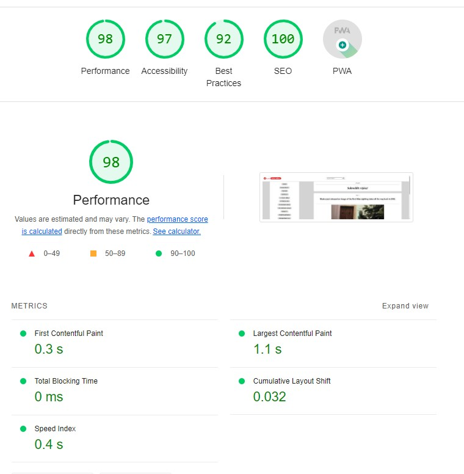

## Git Clone
1. git clone https://github.com/richiehales/richie-reddit-app.git

## Install
1. npm install
2. npm i react-router-dom

## Future additions
1. Display comments under relevent post
2. Display replies underneath comments

## Lighthouse Report

## Wireframe

## Last Push
Office Thursday 12:00

