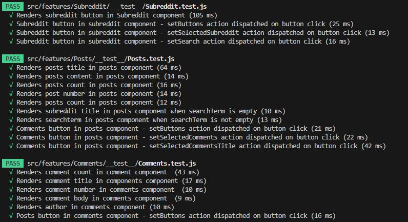

## Installation
1. git clone https://github.com/richiehales/richie-reddit-app.git
2. npm install
3. npm i react-router-dom
4. npm install redux-mock-store --save-dev

## Current step
1. Finalise README
      
## Future additions
1. Display comments under relevent post
2. Display replies underneath comments

## Lighthouse Report

## Wireframe

## Testing Overview

## Testing Results

## Last Push
Home Thursday 18:00

