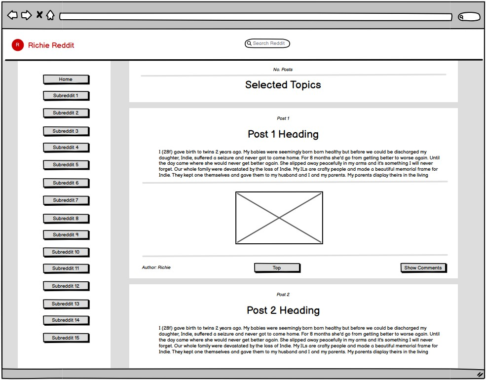

## Git Clone
1. git clone https://github.com/richiehales/richie-reddit-app.git

## Install
1. npm install
2. npm i react-router-dom
3. npm install redux-mock-store --save-dev

## Current step
1. Write Tests 
   1a. Redux docs - https://redux.js.org/usage/writing-tests#:~:text=Redux%20can%20be%20tested%20with,by%20the%20Redux%20library%20repos.
   1b. Net Ninja - https://www.youtube.com/watch?v=7dTTFW7yACQ&list=PL4cUxeGkcC9gm4_-5UsNmLqMosM-dzuvQ
   1c. Mock Server - https://mswjs.io/docs/
   1d. test React-Redux connected Components - https://www.robinwieruch.de/react-connected-component-test/
      
## Future additions
1. Display comments under relevent post
2. Display replies underneath comments

## Lighthouse Report

## Wireframe

## Last Push
Home Sunday 12:00

